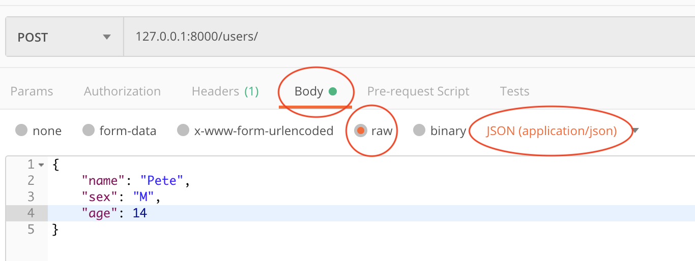

## Create Routes the Good Way
Okay, now we're going to create our objects in a better way than in the section above. The code for this section is in a file called `main-3.py`. If you want to run it, use `pipenv run uvicorn main-3:app --reload`. 
- The first thing we have to do is delete (or comment out) the routes and functions we wrote in the last section, since we're going to doing them in a better way. So, remove `create-user` and `update-user`.
- Now we're going to create an update user route using the request body to send data to the server instead of a query string. FastAPI's docs on it are [here](https://fastapi.tiangolo.com/tutorial/body/)
    - First we need to import `BaseModel` from Pydantic with `from pydantic import BaseModel`. Keep in mind, that since Pydantic is a FastAPI dependecy, when we pip installed FastAPI, Pydantic got installed as well. So, we don't need to pip install it.
    - Now we're going to create a class which will represent the data coming in the body of the request. If you're following along in the FastAPI docs, note that this example will deviate a little from the FastAPI docs.
        ```python
        class UserIn(BaseModel):
            name: str
            age: str
            sex: str
        ```
        - We have inherited from `BaseModel`. This is necessary for us to use it to represent a request body in FastApi.
    - And now we'll create a route to handle the update.
        ```python
        @app.post("/users/")
        async def create_user(userIn: UserIn):
            user = User(userIn.name, userIn.sex, userIn.age)
            fakeDb[len(fakeDb)] = user
            return user
        ```
        (I'll explain what's going on in this function in a second. First we're going to hit it with Postman.)
    - Now we have to hit this route with Postman. To do that, we need to set up our call with a request body.
        - First, obviously, select the method as POST (remember it's in the dropdown to the left of the input where you enter the URL) and the URL `127.0.0.1:8000/users/`. 
        - Now we have to fill in the response body, so in Postman, below the URL input, in a tab which says "Body". Click on it and in the text field which appears write:
            ```json
            {
                "name": "Pete",
                "sex": "M",
                "age": 14
            }
            ```
        This is the data we are sending to the server.
        - Finally, we have to tell the server that our request body is json. That is, there are many formats we could have sent the request body in (XML, key/value, etc) and so we need to tell the server that we're sending JSON so the server knows how to parse what we're sending. Thus, under the Body tab, there is a radio button "raw". Click it and then select "JSON (application/json)" from the dropdown where it has probably defaulted to "Text". By doint this, we have told Postman to send a header called "content-type" along with our request with the value "application/json", which the server will read to determine that our body has been formatted as JSON.
        - Your Postman screen should look something like this:
        
        - Now that we've set Postman up, we can hit our route. The result we see in Postman should be the new user we've created:
            ```json
            {
                "username": "Pete",
                "gender": "M",
                "age": 14
            }
            ```
    - Let's go back to the route we wrote again and look at what's going on.
        ```python
        @app.post("/users/")
        async def create_user(userIn: UserIn):
            user = User(userIn.name, userIn.sex, userIn.age)
            fakeDb[len(fakeDb)] = user
            return user
        ```
        - The first argument is of type UserIn. By doing this, we have told FastAPI to configure a route which will accept a request body in JSON of the form of the `UserIn` class. Namely, it should have `name`, `sex`, and `age` fields. And so this is what we sent in the request body. 
        - Just like we did with the query string data in the previous section, we're creating a new User object, but this time with the data from the request body.
        - Finally, we are adding the user to our fake database (a little more succcintly this time)